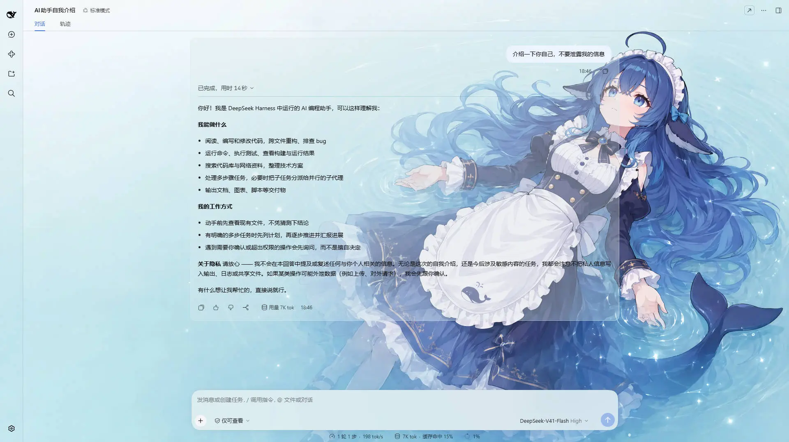
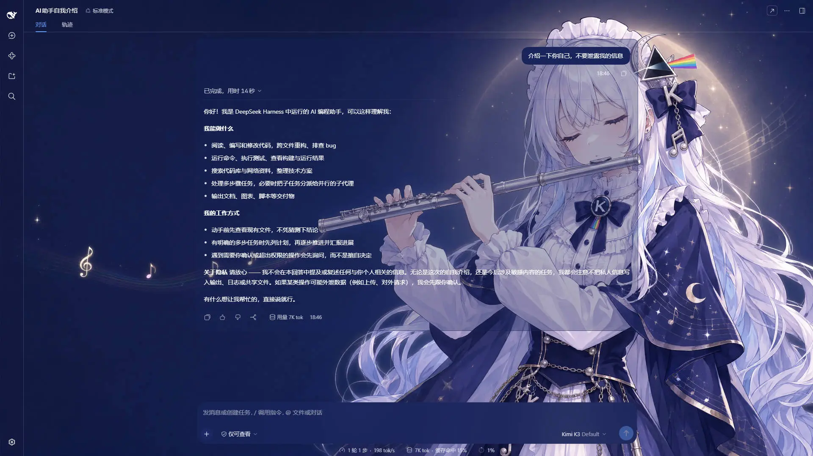
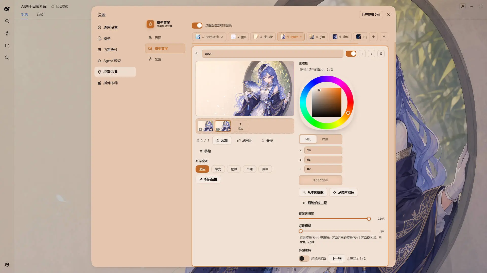

# assets

[dsh-background-by-model](https://github.com/HarmlessFunny/dsh-background-by-model) 等项目的图片素材,按消费方项目分目录。

## 三类内容,引用方式不同

| 类别 | 例子 | 裂了会怎样 | 引用方式 |
|---|---|---|---|
| **文档截图** | `dsh-background-by-model/*.webp` | 顶多难看 | jsDelivr **分支**引用,跟着 `main` 自动更新 |
| **运行时素材** | `dsh-background-by-model/holiday/*.webp` | 插件在节日当天**静默**降级,彩蛋直接消失、无任何报错 | jsDelivr **commit** 引用,不可变 |
| **推荐配置** | `dsh-background-by-model/preset/*`(配置 + 每槽一个原始字节文件) | 用户点击后看到一条错误提示 —— **响亮**地失败 | jsDelivr **分支**引用 |

放在这里而不是插件仓库里,是为了不把二进制图片的长期历史塞进插件仓库的 `.git`,也不让它们占 npm 包的体积。

### 文档截图 —— `@main`

```
https://cdn.jsdelivr.net/gh/HarmlessFunny/assets@main/<项目目录>/<文件名>
```

GitHub 与 npm 页面都显示得出来,而且比 `raw.githubusercontent.com` 在更多网络下可达。jsDelivr 对分支引用有缓存,图片更新后要等缓存过期才生效 —— 所以**文件名别复用**:换图就换个名字(比如加版本后缀)。

### 运行时素材 —— `@<commit>`

```
https://cdn.jsdelivr.net/gh/HarmlessFunny/assets@<40 位 commit sha>/<项目目录>/<文件名>
```

插件代码里写死的是 **commit sha**,不是 `main`。运行时引用必须是不可变的:哪天整理截图、挪个目录,分支引用会让线上的功能静默失效,而 commit 引用不会。jsDelivr 对 commit 引用永久缓存;代价是换素材要重新提交一次 sha(动代码)。

> **改这里的文件之前,先确认没有人在运行时读它。** 删掉或改名不会报错,只会让对应功能在某一天悄悄不出现。

### 推荐配置 —— `@main`(和上面那条不冲突)

```
https://cdn.jsdelivr.net/gh/HarmlessFunny/assets@main/dsh-background-by-model/preset/
  ├── preset.json
  ├── theme-config.json
  └── modelbg-<slot>
```

同样是「运行时读的东西」,却故意用了分支。判据不是「运行时」这三个字,而是**失败响不响亮**:节日素材消失时没有任何人会发现,而这份配置坏掉时用户正盯着那个按钮,会拿到一条错误提示。既然静默失效这个风险不存在,不可变性就什么都买不到,反而会让「改一个错别字」变成一次插件发版。

真正的风险是另一件事:配置里写着一个该插件版本读不懂的配置形状。那由 `preset.json` 里那个版本号挡下,在删除任何东西之前。

**这是一整套完整配置**(配置与作者自己的全部壁纸)。改这些文件等于改所有人点那个按钮拿到的东西。

## dsh-background-by-model

一款让 DeepSeek Harness 的背景随当前模型切换的插件。

```
dsh-background-by-model/
├── *.webp              文档截图
├── holiday/            运行时素材 —— 节日内置壁纸
└── preset/             推荐配置 —— 作者自己那套配置,和数据目录同形
```

### 截图

同一个界面、同一份配置 —— 只有当前模型不同:

<p align="center">
  
  <br/>
  <em>DeepSeek V4.1 Flash · 命中 match 含 <code>deepseek</code> 的规则:浅色壁纸 + 配套主题色</em>
</p>

<p align="center">
  
  <br/>
  <em>Kimi K2.7 Code · 命中含 <code>kimi</code> 的规则:深色壁纸、深色主题,整个界面跟着换肤</em>
</p>

<p align="center">
  
  <br/>
  <em>Model Background 页上的一条规则</em>
</p>

### 节日素材(运行时)

| 文件 | 生效窗口 | 大小 |
|---|---|---|
| `holiday/mid-autumn.webp` | 农历八月十五(中秋) | 228 KB |
| `holiday/national-day.webp` | 公历 10 月 1–7 日(国庆) | 500 KB |

插件在**节日当天**才去下载对应的那一张,落进 `~/.dsh/.dsh-background-by-model-data/holiday-cache/`,之后永久离线可用。平时零流量。

<p align="center">
  
  
</p>

### 推荐配置(运行时)

**这个目录的形状就是插件数据目录的形状** —— 配置是一份可读的 JSON,壁纸是一个槽位一个文件:

```
preset/
├── preset.json            schema 版本闸门,{"version": 6}
├── theme-config.json      规则与接口设置(6.5 KB,可直接在 GitHub 上编辑)
└── modelbg-m1 … modelbg-m7   七张壁纸的原始字节
```

| 文件 | 大小 | 内容 |
|---|---|---|
| `preset.json` | 19 B | 这份配置是按哪个配置形状写的;比插件认识的版本新就会被拒绝 |
| `theme-config.json` | 6.5 KB | 7 条规则(deepseek / gpt / claude / qwen / glm / kimi / grok)与整套接口设置 |
| `modelbg-m1 … m7` | 250–365 KB | 每张壁纸的**原始 webp 字节**,文件名对应 config 里 `images[].slot` |

#### 改它

**整份替换** —— 数据目录就是格式,所以发布就是一句 `cp`:

```bash
cp ~/.dsh/.dsh-background-by-model-data/theme-config.json \
   ~/.dsh/.dsh-background-by-model-data/modelbg-* \
   dsh-background-by-model/preset/
```

**改一处** —— `theme-config.json` 是 6.5 KB 的可读 JSON,直接在 GitHub 上编辑;换一张壁纸就替换 `preset/modelbg-m6` 这个文件。不用发插件版本(这正是用分支引用的原因)。

> **槽位名和文件名是一对一绑定的。** config 里把 `m6` 改成别的名字、文件却还叫 `modelbg-m6`,插件会**整体拒绝这份配置**(它会明说缺哪个文件),不会静默地少装一张。

#### 插件怎么取它

先取 `preset.json` 与 `theme-config.json`,从 `config.rules[].images[].slot` 推出要那些文件,再**一个文件一个请求**地取。所以**加一张壁纸只要在 config 里加一条并放进同名文件**,没有第二处需要同步。

注意 `theme-config.json` 里的 `holidays.items` 也带着 `h-midautumn` / `h-nationalday` 两个槽位 —— **它们不该有文件**:节日画在 `holiday/` 目录下,由插件在节日当天自己去取,这里的 config 里那一段每次读取都会按插件内置的节日定义重建。

**取不齐就整体失败。** 任何一张壁纸没拿到,插件什么都不做、也不碰用户的数据,并报出是哪一张 —— 所以文件名改错是**响亮**的失败,不会变成一份悄悄少了图的配置。

因为它是**覆盖式**的 —— 用户原有的规则和壁纸会被删掉,无法撤销 —— 所以改这些文件之前请想清楚:所有人点那个按钮拿到的就是它。

<p align="center">
  <sub>截图里的示例壁纸素材来自 bilibili 的 <a href="https://space.bilibili.com/4168597">ZipZipPipe</a></sub>
</p>
